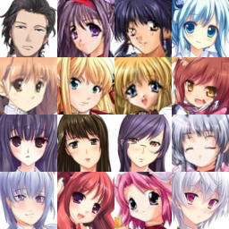
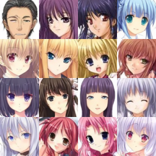

# Anime Girls Generation
Learning diffusion models through anime girls generation

## DDPM
### First results

### Notes
* Images are quite ok
* Training was not stable. For some reason crucial to tune batch size properly -- with 128 I got the results, but with bs 64 or 512 loss suddenly went to nans.
* Got some warnings: "Grad strides do not match bucket view strides."
* Swapped precision to fp32 -> no nans...

### Final results
* UNet with ~300kk parameters
* Resolution blocks: [64, 128, 256, 512, 1024]
* Resnet layer per block: 2
* Last two blocks have spatial attention
* Steps: 250kk
* Batch size: 128
* lr: 2e-4, cosine warmup
* Linear noise scheduler

Tried two versions: with horizontal flip each time image is taken from dataset and without it.

Horizontal flip:

Horizontal flip:

Images of the model without flip are more consistent, have fewer artifacts and better structure. 
So either the augmentation worsen the training or it's supposed to be used only once.

No flip model checkpoint link (diffusers unet): https://falca-bucket.s3.eu-central-1.amazonaws.com/anime-faces-500.zip